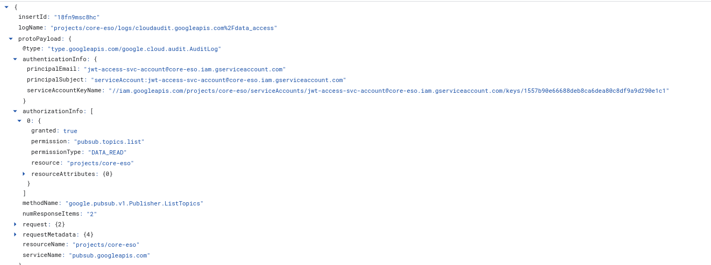

## GCP JWTAccessToken Authentication

Set of samples for GCP `JWTAccesToken` based authentication to GCP resources.

`JWTAccessToken` are basically a locally signed JWT which can be used directly to authenticate to GCP services:

- [Addendum: Service account authorization without OAuth](https://developers.google.com/identity/protocols/oauth2/service-account#jwt-auth)
- [AIP-4111 Self-signed JWT](https://google.aip.dev/auth/4111)

As described in the links above, there are two forms of JWTAccessTokens:

* JWTAccessToken with Audience
  This restricts the service the jwt can be used for (eg only `https://pubsub.googleapis.com/google.pubsub.v1.Publisher`)

* JWTAccessTOken with Scope
  This restricts the scope(s) the jwt can be used for (eg `https://www.googleapis.com/auth/cloud-platform`)

The Scope based token is a lot more flexible but allows for wider access (i.,e you can use the jwt to call different GCP services)
 
### Setup

Each sample below will enumerate pubsub topics in a given project.  

First download a key:

```bash
export PROJECT_ID=`gcloud config get-value core/project`

gcloud iam service-accounts create jwt-access-svc-account --display-name "Test Service Account"

export SERVICE_ACCOUNT_EMAIL=jwt-access-svc-account@$PROJECT_ID.iam.gserviceaccount.com

mkdir certs/
gcloud iam service-accounts keys create certs/jwt-access-svc-account.json --iam-account=$SERVICE_ACCOUNT_EMAIL

gcloud projects add-iam-policy-binding $PROJECT_ID --member=serviceAccount:$SERVICE_ACCOUNT_EMAIL --role=roles/pubsub.viewer
```

Then for each sample below, edit the source and replace the projectID with yours

#### golang

```bash
go run main.go
```

#### python

```bash
pip3 install -r requirements.txt
python3 main.py
```

#### java

```bash
mvn clean install exec:java
```

#### nodejs

>>> ***NOTE, see [issue1960: JWTAccess email and private key read from service account JSON names mismatched](https://github.com/googleapis/google-auth-library-nodejs/issues/1960)

```bash
npm -i
node app.js
```

#### dotnet

```bash
dotnet run
```


### TPM-based JWT AccessToken

You can also embed the service account into Hardware (TPM) and from there mint tokens:

- [go: oauth2 TPM TokenSource](https://github.com/salrashid123/oauth2)
- [TPM Credential Source for Google Cloud SDK](https://github.com/salrashid123/gcp-adc-tpm)
- [go: PKCS-11 Credential Source for Google Cloud SDK](https://github.com/salrashid123/gcp-adc-pkcs)
- [Python: Cloud Auth Library using Trusted Platform Module (TPM)](https://github.com/salrashid123/cloud_auth_tpm)
- [golang-jwt for Trusted Platform Module (TPM)](https://github.com/salrashid123/golang-jwt-tpm)
- [golang-jwt for PKCS11](https://github.com/salrashid123/golang-jwt-pkcs11)

### AuditLogging

GCP Audit logs (if enabled), will show access and the key used to sign the request.  It does not directly indicate that a self-signed JWT AccessToken was used but it does show the keyid for the service account that was used:



Also see [GCP Service Account Last usage auditing using Golang](https://blog.salrashid.dev/articles/2022/service_account_usage/)


### Random

The following are hypothetical restrictions (i.,e these are just ideas google could implement)


* Bind the JWTAccessToken to the TLS connection (Channel Binding)
   
  If you wanted to say "this JWT is only valid for this TLS session"

  - [Exported Key Material (EKM) in golang and openssl](https://github.com/salrashid123/go_ekm_tls?tab=readme-ov-file#http-with-jwt-bound-token)
  - [TPM One Time Password using TLS SessionKey](https://github.com/salrashid123/tls_tpm_one_time_password)

```json
{
  "alg": "RS256",
  "kid": "1557b90e66688deb8ca6dea80c8df9a9d290e1c1",
  "typ": "JWT"
}
{
  "iss": "jwt-access-svc-account@core-eso.iam.gserviceaccount.com",
  "sub": "jwt-access-svc-account@core-eso.iam.gserviceaccount.com",
  "exp": 1773758340,
  "iat": 1742999940,
  "scope": "https://www.googleapis.com/auth/cloud-platform",
  "cnf": {
    "kid": "L2TMLRO_QQ2foeNgul5-1BaARkRE9JG7_vrlx-CzM_4"
  }
}
```

* Bind the JWTAccessToken to an mTLS clientCertificate

  If you wanted to say "this JWT is only valid if the TLS connection involves this client certificate"

  - Similar to [Certificate Bound Tokens using Security Token Exchange Server (STS)](https://github.com/salrashid123/cert_bound_sts_server)
    except that the jwt is locally signed (no sts involved)
    

```json
{
  "alg": "RS256",
  "kid": "1557b90e66688deb8ca6dea80c8df9a9d290e1c1",
  "typ": "JWT"
}
{
  "iss": "jwt-access-svc-account@core-eso.iam.gserviceaccount.com",
  "sub": "jwt-access-svc-account@core-eso.iam.gserviceaccount.com",
  "exp": 1773758340,
  "iat": 1742999940,
  "scope": "https://www.googleapis.com/auth/cloud-platform",
  "cnf": {
    "x5t#S256": "A7iOckLIMP4o8YXW4voDTxGKguoTAu39TvBmtRi2jw4="
  }
}
```


